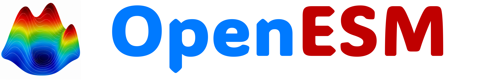
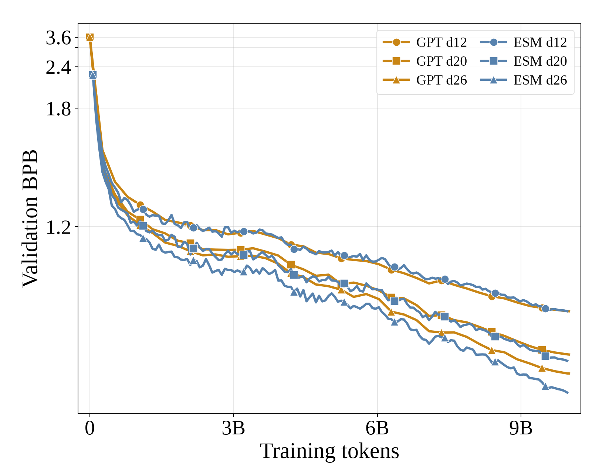
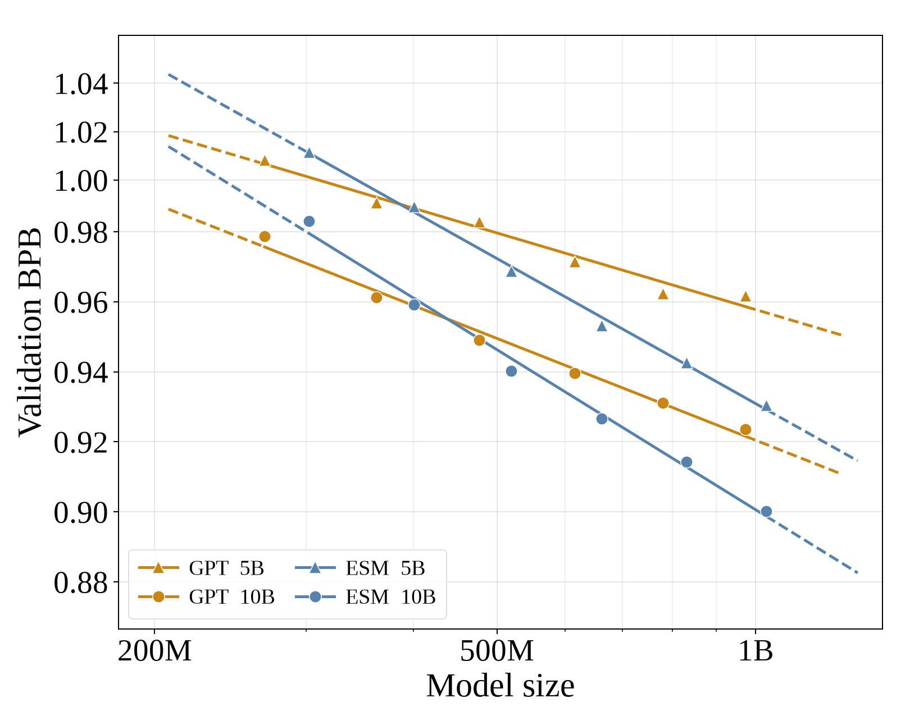
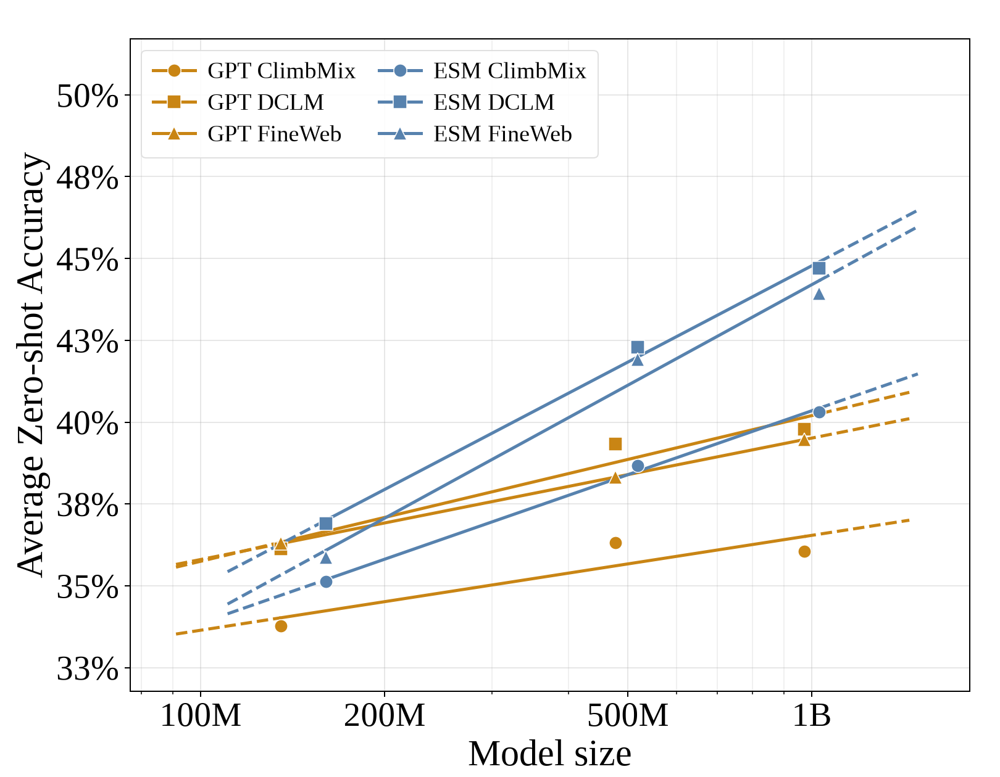
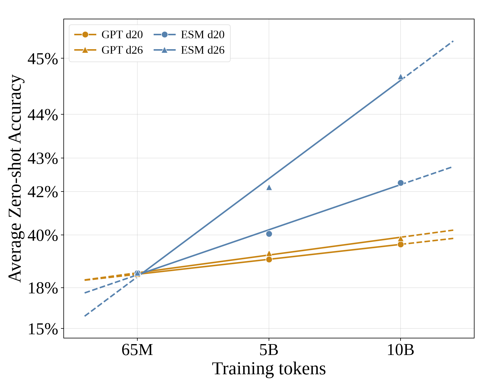
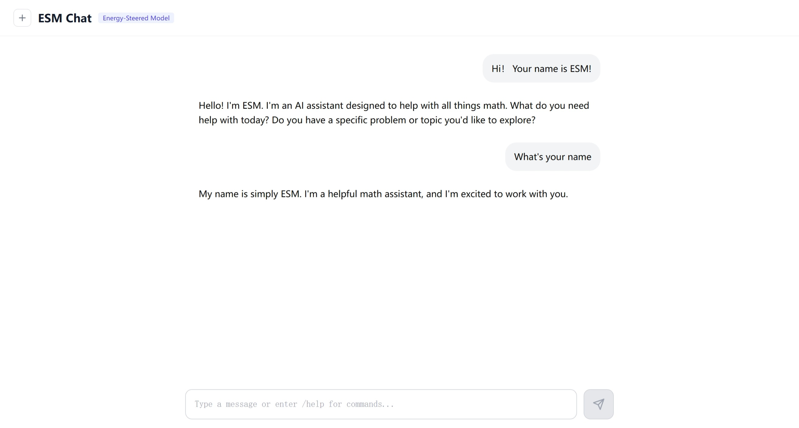

<p align="center">
  
</p>

<p align="center">
  <a href="https://github.com/datamllab/openesm"></a>
  <a href="https://huggingface.co/collections/guan-wang/openesm"></a>
</p>

<p align="center">
  <strong>Open-source code for training and scaling Energy-Steered Models</strong>
</p>

<p align="center">
  <strong>Keywords: </strong> Energy-Steered Models, language models, pretraining, scaling laws
</p>


<p align="center">
  <a href="#-updates">🎉 Updates</a> •
  <a href="#-quick-start">🚀 Quick Start</a> •
  <a href="#-scaling-law">📈 Scaling Law</a> •
  <a href="#-pretrained-checkpoints">⚙️ Pretrained Checkpoints</a> •
  <a href="#-chat-demo">💬 Chat Demo</a>
</p>


<p align="center">
  English · <a href="README_zh.md">简体中文</a>
</p>

---

## 🎉 Updates

- **2026-10-07** — ✨✨ Full codebase released.


## 🚀 Quick Start

Install the GPU, Hugging Face, and web-chat dependencies once:

```bash
uv sync --extra gpu --extra hf --extra web
source .venv/bin/activate
```

Run a complete training job by setting the token budget:

```bash
TARGET_TOTAL_TOKENS=100000000 bash runs/train.sh
```

## 📈 Scaling Law

On DCLM, validation BPB falls as training tokens and model size increase.
Zero-shot accuracy scales with model size across ClimbMix, DCLM, and FineWeb,
and improves with training tokens.

<table>
  <tr>
    <td align="center" width="50%"><br>DCLM pretraining</td>
    <td align="center" width="50%"><br>Parameter scaling</td>
  </tr>
  <tr>
    <td align="center" width="50%"><br>Zero-shot model-size scaling</td>
    <td align="center" width="50%"><br>Zero-shot token scaling</td>
  </tr>
</table>

Use `configs/train.yaml` as the default configuration and set
`TARGET_TOTAL_TOKENS` to choose the training budget.

## ⚙️ Pretrained Checkpoints

Pretrained models are published in the
[OpenESM Hugging Face collection](https://huggingface.co/collections/guan-wang/openesm).
The collection includes 160M, 520M, and 1B models trained on DCLM, FineWeb, and
ClimbMix; one 160M OWT model; and a FineWeb SFT model named
`ESM-FineWeb-1B-CHAT`.

Load a published model directly by its Hugging Face ID. The first call downloads
and caches the weights and tokenizer:

```python
import torch
from esm.modeling_esm import load_checkpoint

model_id = "guan-wang/ESM-FineWeb-1B-CHAT"
model, tokenizer, hparams, device = load_checkpoint(model_id, device="cuda")
tokens = tokenizer.encode("Hello, ESM.", append=tokenizer.get_bos_token_id())
input_ids = torch.tensor([tokens], dtype=torch.long, device=device)
with torch.no_grad():
    logits = model(input_ids)
print(logits.shape)
```

Replace the model ID with any repository listed in the collection.

## 💬 Chat Demo

<p align="center">
  
</p>

Run the browser chat with the published SFT model:

```bash
bash runs/chat.sh --web \
  --checkpoint guan-wang/ESM-FineWeb-1B-CHAT \
  --host 0.0.0.0 \
  --port 8000
```

Open [http://localhost:8000](http://localhost:8000) in a browser on the server
machine. If the server runs on a remote GPU node, use your cluster's port
forwarding to expose port 8000 on your local machine.

The PyTorch CPU and CUDA indexes are configured in `pyproject.toml`. Choose
one extra per environment.

## Run

The shell launchers are deliberately thin. They always run from the project
root, so relative paths are stable in local shells and distributed jobs.

```bash
# Pretraining: training length comes from TARGET_TOTAL_TOKENS.
TARGET_TOTAL_TOKENS=100000000 bash runs/train.sh

# Fine-tuning: initialize from a published Hugging Face model.
TARGET_TOTAL_TOKENS=100000000 bash runs/sft.sh \
  --dataset_name esm_sft \
  --finetuning_model_ckpt guan-wang/ESM-DCLM-1B

# Position-wise BPB evaluation.
MODEL_DIR="$(python -c 'from huggingface_hub import snapshot_download; print(snapshot_download(repo_id="guan-wang/ESM-DCLM-1B"))')"
bash runs/eval.sh \
  --checkpoint guan-wang/ESM-DCLM-1B \
  --dataset dclm \
  --data-dir /path/to/data \
  --tokenizer-path "${MODEL_DIR}" \
  --output_root . \
  --run_name eval-dclm

# QA evaluation.
bash runs/qa.sh \
  --checkpoint guan-wang/ESM-DCLM-1B \
  --tokenizer-path "${MODEL_DIR}" \
  --eval-bundle /path/to/eval_bundle \
  --output_root . \
  --run_name qa-dclm

# Interactive generation.
bash runs/chat.sh --checkpoint guan-wang/ESM-FineWeb-1B-CHAT
```

Chat, validation evaluation, QA evaluation, and SFT initialization accept
published Hugging Face model IDs. BPB evaluation also needs the local snapshot
directory for `token_bytes.pt`. Zero-shot evaluation currently expects a local
Lightning checkpoint.

Training reads `configs/train.yaml`; evaluation reads `configs/eval.yaml`.
Explicit command-line arguments take precedence over YAML values. Training
length is controlled by `TARGET_TOTAL_TOKENS`. The effective gradient
accumulation is derived from `global_batch_size`, `device_batch_size`, and the
distributed world size, so `max_steps` and `accumulate_grad_batches` are not
independent training controls.

Every run uses the same output layout:

```text
outputs/<run-name>/
├── checkpoints/
├── logs/
│   └── wandb/
└── results/
```

Data and tokenizer assets are not included in the repository. Pass their
locations through the configuration or command line. Supported pretraining
and BPB datasets include DCLM, FineWeb, ClimbMix, and OWT.

## Load from Hugging Face

`load_checkpoint()` accepts a Hugging Face model ID and downloads the
Transformers weights and tokenizer automatically. For example:

```python
import torch
from esm.modeling_esm import load_checkpoint

model, tokenizer, hparams, device = load_checkpoint(
    "guan-wang/ESM-OWT-160M", device="cuda"
)
tokens = tokenizer.encode("hello", append=tokenizer.get_bos_token_id())
input_ids = torch.tensor([tokens], dtype=torch.long, device=device)
with torch.no_grad():
    logits = model(input_ids)
print(logits.shape)
```

For BPB evaluation, download the same model repository locally and pass that
directory as `--tokenizer-path`; it contains the tokenizer byte table used by
the metric. The loader also supports local Transformers directories and
Lightning checkpoints produced by this training code.

## Repository layout

```text
openesm/
├── assets/                                  # Repository branding assets
│   └── openesm-github-title.png             # README title banner
├── configs/                                 # Default run configurations
│   ├── eval.yaml                 # Evaluation defaults
│   └── train.yaml                # Pretraining defaults
├── esm/                                     # Model, data, and training library
│   ├── __init__.py                           # Package initialization
│   ├── common.py                             # Shared constants and utilities
│   ├── config.py                             # Training and evaluation config parsing
│   ├── configuration_esm.py                  # Transformers model configuration
│   ├── core_eval.py                          # Core benchmark evaluation
│   ├── dataloader.py                         # Streaming data loaders
│   ├── dataset.py                             # Shared dataset utilities
│   ├── dataset_sft.py                        # Supervised fine-tuning datasets
│   ├── disk_aware_checkpoint.py              # Checkpoint save/load utilities
│   ├── logger.py                              # Training metric and artifact logging
│   ├── metrics.py                             # Loss and BPB metrics
│   ├── modeling_esm.py                        # ESM architecture, loading, and inference
│   ├── optim.py                               # Muon and AdamW optimizers and schedules
│   ├── pretrain_dataset.py                    # Pretraining data pipeline
│   ├── tokenizer.py                           # ESM tokenizer and tokenizer loading
│   └── trainer.py                             # Lightning training and evaluation module
├── figs/                                    # README figures and demo images
│   ├── chat.jpg                               # Web chat interface screenshot
│   ├── dclm_best_val_bpb_vs_depth.png          # DCLM parameter scaling plot
│   ├── qa_acc_vs_model_size.png                # Zero-shot accuracy by model size
│   ├── scaling_pretrain_dclm_validation_bpb.png # DCLM validation BPB by tokens
│   └── zero_shot_acc_vs_training_tokens.png    # Zero-shot accuracy by tokens
├── runs/                                    # Shell entry points for common workflows
│   ├── chat.sh                   # Launch interactive chat
│   ├── eval.sh                   # Run validation evaluation
│   ├── prepare_data.sh           # Prepare and tokenize datasets
│   ├── qa.sh                     # Run task-based QA evaluation
│   ├── sft.sh                    # Fine-tune from a checkpoint
│   ├── train.sh                  # Pretrain an ESM model
│   └── zeroshot.sh               # Run zero-shot benchmarks
├── scripts/                                 # Python command-line entry points
│   ├── chat.py                   # Serve terminal or web chat
│   ├── eval.py                   # Evaluate validation loss and BPB
│   ├── export_hf.py              # Export a checkpoint to Transformers format
│   ├── prepare_data.py           # Build training and evaluation data
│   ├── qa.py                     # Evaluate QA task suites
│   ├── sft.py                    # Run supervised fine-tuning
│   ├── train.py                  # Run pretraining
│   ├── zeroshot.py               # Run zero-shot benchmark evaluation
│   └── zeroshot_datasets.py      # Define zero-shot benchmark datasets
├── tasks/                                   # Dataset/task adapters for evaluation
│   ├── common.py                             # Shared task interfaces and helpers
│   ├── customjson.py                         # Load custom JSON evaluation tasks
│   ├── gsm8k.py                              # GSM8K math reasoning task
│   ├── mmlu.py                               # MMLU multiple-choice task
│   ├── smoltalk.py                           # SmolTalk conversation task
│   └── spellingbee.py                        # SpellingBee word-generation task
├── tests/                                   # Lightweight unit and compatibility tests
│   ├── test_config_and_boundaries.py       # Validate config and data boundaries
│   ├── test_dataloader_lightweight_state.py # Check lightweight loader state
│   ├── test_dataset_sft_mask.py            # Check SFT loss masking
│   ├── test_hf_configuration.py            # Check Transformers configuration
│   └── test_modeling_esm_rope.py           # Check rotary embeddings
├── .gitignore                                # Excludes local data, outputs, and caches
├── pyproject.toml                            # Package metadata and dependency groups
├── README.md                                 # English project guide
├── README_zh.md                              # Simplified Chinese project guide
└── uv.lock                                   # Locked dependency versions
```

## Development

```bash
uv sync --extra cpu --group dev
pytest -q
python -m scripts.train --help
python -m scripts.eval --help
python -m scripts.qa --help
python -m scripts.chat --help
```
