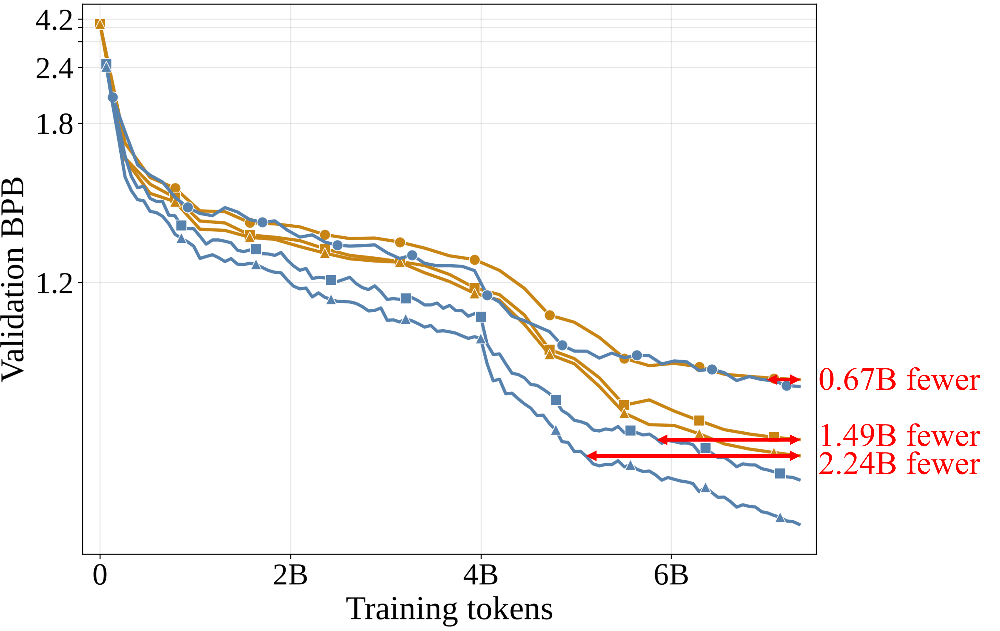
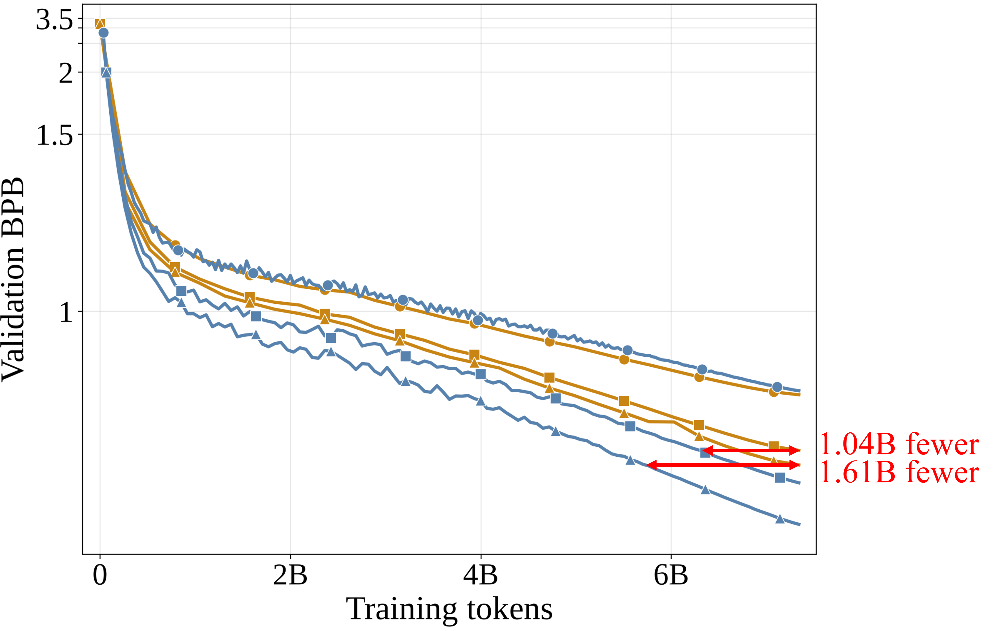
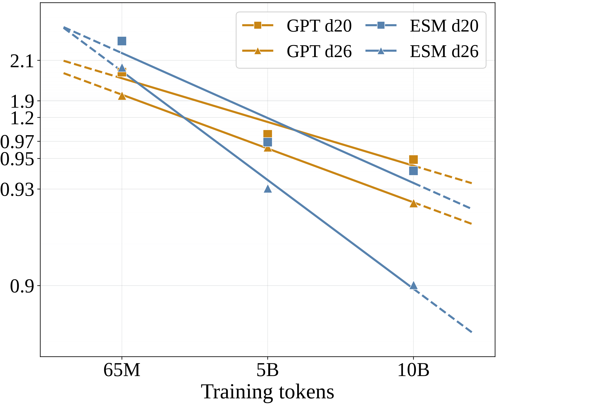
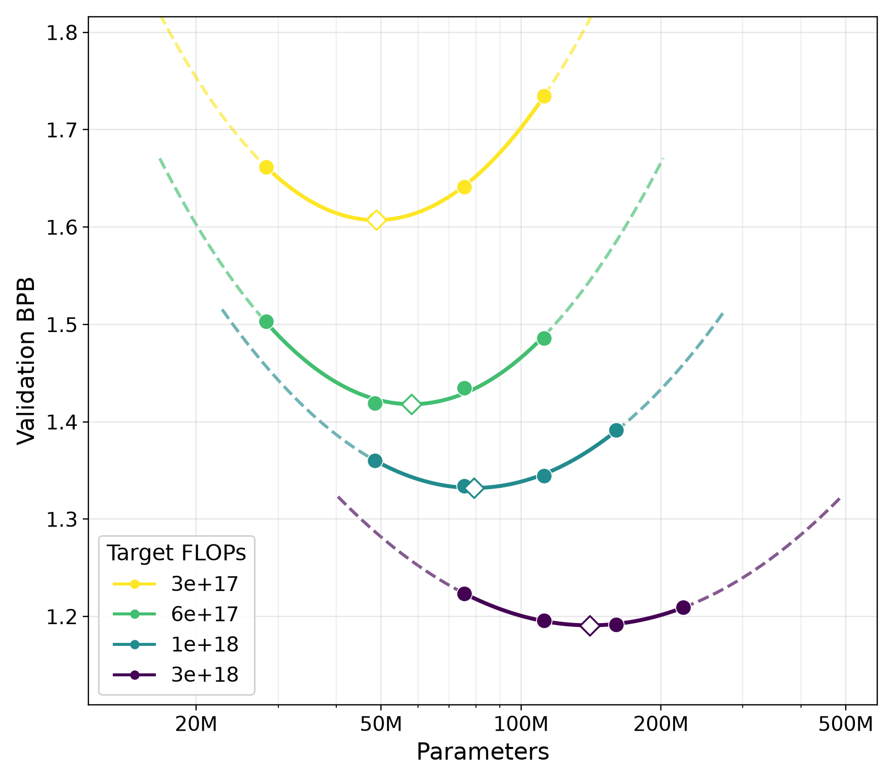

<p align="center">
  
</p>

<p align="center">
  <a href="https://github.com/datamllab/openesm"></a>
  <a href="https://huggingface.co/collections/guan-wang/openesm"></a>
</p>

<p align="center">
  <strong>Open-source code for training and scaling Energy-Steered Models</strong>
</p>

<p align="center">
  <strong>Keywords: </strong> Energy-Steered Models, language models, pretraining, scaling laws
</p>


<p align="center">
  <a href="#-updates">🎉 Updates</a> •
  <a href="#-quick-start">🚀 Quick Start</a> •
  <a href="#-scaling-law">📈 Scaling Law</a> •
  <a href="#-pretrained-checkpoints">⚙️ Pretrained Checkpoints</a> •
  <a href="#-chat-demo">💬 Chat Demo</a>
</p>


<p align="center">
  English · <a href="README_zh.md">简体中文</a>
</p>

---

## 🎉 Updates

- **2026-10-07** — ✨✨ Full codebase released.


## 🚀 Quick Start

Install the project from the repository root. Select one PyTorch extra:

```bash
# NVIDIA GPU
uv sync --extra gpu

# CPU-only machine
uv sync --extra cpu
```

Run a complete training job by setting the token budget:

```bash
TARGET_TOTAL_TOKENS=100000000 bash runs/train.sh
```

Run evaluation or interactive generation with a checkpoint:

```bash
bash runs/eval.sh --checkpoint /path/to/model.ckpt \
  --dataset dclm --data-dir /path/to/data

bash runs/chat.sh --checkpoint /path/to/model.ckpt \
  --tokenizer-path /path/to/tokenizer

# Browser UI and streaming API
uv sync --extra gpu --extra web
bash runs/chat.sh --web --checkpoint /path/to/model.ckpt --port 8000
```

Published checkpoints can also be loaded directly with Transformers. Install
the optional Hugging Face dependencies with `uv sync --extra gpu --extra hf`
and follow the example in the checkpoint section below.

## 📈 Scaling Law

Validation BPB decreases with training tokens on ClimbMix, DCLM, and FineWeb.
On DCLM, the results also show lower validation error at larger token budgets
and model depths, while IsoFLOP curves indicate that the compute-optimal model
size grows with the training budget.

<table>
  <tr>
    <td align="center" width="50%"><br>ClimbMix</td>
    <td align="center" width="50%"><br>DCLM</td>
  </tr>
  <tr>
    <td align="center" width="50%"><br>FineWeb</td>
    <td align="center" width="50%"><br>Token scaling</td>
  </tr>
  <tr>
    <td align="center" width="50%"><br>Depth scaling</td>
    <td align="center" width="50%"><br>IsoFLOP scaling</td>
  </tr>
</table>

Use `configs/train.yaml` as the default configuration and set
`TARGET_TOTAL_TOKENS` to choose the training budget.

## ⚙️ Pretrained Checkpoints

Pretrained models are published in the
[OpenESM Hugging Face collection](https://huggingface.co/collections/guan-wang/openesm).
The collection includes models trained on OWT, DCLM, FineWeb, and ClimbMix in
the 160M, 520M, and 1B parameter classes, together with the FineWeb SFT model.

The recommended repository format is the standard Transformers format. A
legacy Lightning checkpoint can be converted with:

```bash
uv sync --extra cpu --extra hf
python -m scripts.export_hf \
  /path/to/model.ckpt \
  /path/to/hf-model \
  --tokenizer-dir /path/to/tokenizer
```

The exported directory contains `config.json`, `model.safetensors`, the
custom modeling and configuration files, and tokenizer files. It can then be
loaded with:

```python
from transformers import AutoModelForMaskedLM, AutoTokenizer

model_id = "guan-wang/ESM-OWT-160M"
tokenizer = AutoTokenizer.from_pretrained(model_id, trust_remote_code=True)
model = AutoModelForMaskedLM.from_pretrained(model_id, trust_remote_code=True)
```

## 💬 Chat Demo

<p align="center">
  
</p>

Run the interactive demo with a local checkpoint:

```bash
bash runs/chat.sh \
  --checkpoint /path/to/model.ckpt \
  --tokenizer-path /path/to/tokenizer
```

The demo uses the checkpoint's saved hyperparameters and supports the same
tokenizer assets as standalone checkpoint loading.

From the repository root:

```bash
uv sync --extra gpu
```

Use `--extra cpu` on a CPU-only machine. Add `--group dev` for the test
dependencies:

```bash
uv sync --extra cpu --group dev
```

The PyTorch CPU and CUDA indexes are configured in `pyproject.toml`. Choose
one extra per environment.

## Run

The shell launchers are deliberately thin. They always run from the project
root, so relative paths are stable in local shells and distributed jobs.

```bash
# Pretraining: training length comes from TARGET_TOTAL_TOKENS.
TARGET_TOTAL_TOKENS=100000000 bash runs/train.sh

# Supervised fine-tuning from an explicit checkpoint.
bash runs/sft.sh \
  --execution_mode finetune \
  --dataset_name esm_sft \
  --finetuning_model_ckpt /path/to/pretrain.ckpt

# Position-wise BPB evaluation.
bash runs/eval.sh \
  --checkpoint /path/to/model.ckpt \
  --dataset dclm \
  --data-dir /path/to/data \
  --output_root . \
  --run_name eval-dclm

# QA evaluation.
bash runs/qa.sh \
  --checkpoint /path/to/model.ckpt \
  --eval-bundle /path/to/eval_bundle \
  --output_root . \
  --run_name qa-dclm

# Interactive generation.
bash runs/chat.sh --checkpoint /path/to/model.ckpt

# Zero-shot evaluation uses an OWT-pretrained checkpoint and prepared data.
CKPT=/path/to/owt-model.ckpt DATA_ROOT=/path/to/zeroshot-data \
  bash runs/zeroshot.sh
```

Training reads `configs/train.yaml`; evaluation reads `configs/eval.yaml`.
Explicit command-line arguments take precedence over YAML values. Training
length is controlled by `TARGET_TOTAL_TOKENS`. The effective gradient
accumulation is derived from `global_batch_size`, `device_batch_size`, and the
distributed world size, so `max_steps` and `accumulate_grad_batches` are not
independent training controls.

Every run uses the same output layout:

```text
outputs/<run-name>/
├── checkpoints/
├── logs/
│   └── wandb/
└── results/
```

Data and tokenizer assets are not included in the repository. Pass their
locations through the configuration or command line. Supported pretraining
and BPB datasets include DCLM, FineWeb, ClimbMix, and OWT.

## Standalone checkpoint loading

`esm/modeling_esm.py` contains the model classes and loader for Lightning
checkpoints. To share a Lightning checkpoint for direct ESM loading, include
the checkpoint and tokenizer assets alongside this file:

```text
model-repository/
├── modeling_esm.py
├── model.ckpt
└── tokenizer/
    ├── tokenizer.pkl
    └── token_bytes.pt
```

Install PyTorch and `tiktoken`, copy `modeling_esm.py` beside the checkpoint,
and run:

```python
import torch
from modeling_esm import load_checkpoint

model, tokenizer, hparams, device = load_checkpoint(
    "model.ckpt",
    tokenizer_path="tokenizer",
)

input_ids = torch.tensor(
    [tokenizer.encode("hello", append=tokenizer.get_bos_token_id())],
    device=device,
)
logits = model(input_ids)
print(logits.shape)
```

If the checkpoint and `tokenizer/` directory are siblings, omit
`tokenizer_path`. `token_bytes.pt` is needed for BPB evaluation; logits-only
inference only needs `tokenizer.pkl`. The loader accepts a Lightning
checkpoint, a local Transformers directory, or a Hugging Face model ID and
returns the same inference interface. Standard Transformers repositories
also include `configuration_esm.py`, model weights, `config.json`, and
tokenizer files; `scripts/export_hf.py` creates this layout.

## Repository layout

```text
openesm/
├── assets/                                  # Repository branding assets
│   └── openesm-github-title.png             # README title banner
├── configs/                                 # Default run configurations
│   ├── eval.yaml                 # Evaluation defaults
│   └── train.yaml                # Pretraining defaults
├── esm/                                     # Model, data, and training library
│   ├── __init__.py                           # Package initialization
│   ├── common.py                             # Shared constants and utilities
│   ├── config.py                             # Training and evaluation config parsing
│   ├── configuration_esm.py                  # Transformers model configuration
│   ├── core_eval.py                          # Core benchmark evaluation
│   ├── dataloader.py                         # Streaming data loaders
│   ├── dataset.py                             # Shared dataset utilities
│   ├── dataset_sft.py                        # Supervised fine-tuning datasets
│   ├── disk_aware_checkpoint.py              # Checkpoint save/load utilities
│   ├── logger.py                              # Training metric and artifact logging
│   ├── metrics.py                             # Loss and BPB metrics
│   ├── modeling_esm.py                        # ESM architecture, loading, and inference
│   ├── optim.py                               # Muon and AdamW optimizers and schedules
│   ├── pretrain_dataset.py                    # Pretraining data pipeline
│   ├── tokenizer.py                           # ESM tokenizer and tokenizer loading
│   └── trainer.py                             # Lightning training and evaluation module
├── figs/                                    # README figures and demo images
│   ├── chat.jpg                               # Web chat interface screenshot
│   ├── dclm_best_val_bpb_vs_depth.png          # DCLM depth scaling plot
│   ├── dclm_best_val_bpb_vs_tokens.png         # DCLM token scaling plot
│   ├── scaling_isoflop_dclm.png                # DCLM IsoFLOP scaling plot
│   ├── scaling_pretrain_climbmix_validation_bpb.png # ClimbMix validation BPB plot
│   ├── scaling_pretrain_dclm_validation_bpb.png     # DCLM validation BPB plot
│   └── scaling_pretrain_fineweb_validation_bpb.png  # FineWeb validation BPB plot
├── runs/                                    # Shell entry points for common workflows
│   ├── chat.sh                   # Launch interactive chat
│   ├── eval.sh                   # Run validation evaluation
│   ├── prepare_data.sh           # Prepare and tokenize datasets
│   ├── qa.sh                     # Run task-based QA evaluation
│   ├── sft.sh                    # Fine-tune from a checkpoint
│   ├── train.sh                  # Pretrain an ESM model
│   └── zeroshot.sh               # Run zero-shot benchmarks
├── scripts/                                 # Python command-line entry points
│   ├── chat.py                   # Serve terminal or web chat
│   ├── eval.py                   # Evaluate validation loss and BPB
│   ├── export_hf.py              # Export a checkpoint to Transformers format
│   ├── prepare_data.py           # Build training and evaluation data
│   ├── qa.py                     # Evaluate QA task suites
│   ├── sft.py                    # Run supervised fine-tuning
│   ├── train.py                  # Run pretraining
│   ├── zeroshot.py               # Run zero-shot benchmark evaluation
│   └── zeroshot_datasets.py      # Define zero-shot benchmark datasets
├── tasks/                                   # Dataset/task adapters for evaluation
│   ├── common.py                             # Shared task interfaces and helpers
│   ├── customjson.py                         # Load custom JSON evaluation tasks
│   ├── gsm8k.py                              # GSM8K math reasoning task
│   ├── mmlu.py                               # MMLU multiple-choice task
│   ├── smoltalk.py                           # SmolTalk conversation task
│   └── spellingbee.py                        # SpellingBee word-generation task
├── tests/                                   # Lightweight unit and compatibility tests
│   ├── test_config_and_boundaries.py       # Validate config and data boundaries
│   ├── test_dataloader_lightweight_state.py # Check lightweight loader state
│   ├── test_dataset_sft_mask.py            # Check SFT loss masking
│   ├── test_hf_configuration.py            # Check Transformers configuration
│   └── test_modeling_esm_rope.py           # Check rotary embeddings
├── .gitignore                                # Excludes local data, outputs, and caches
├── pyproject.toml                            # Package metadata and dependency groups
├── README.md                                 # English project guide
├── README_zh.md                              # Simplified Chinese project guide
└── uv.lock                                   # Locked dependency versions
```

Cluster-specific rjob submitters, private data, checkpoints, caches, logs,
and generated outputs are kept outside the public source tree or ignored by
`.gitignore`.

## Development

```bash
uv sync --extra cpu --group dev
pytest -q
python -m scripts.train --help
python -m scripts.eval --help
python -m scripts.qa --help
python -m scripts.chat --help
```

The public tree is intended to stay small: the model, its data interfaces,
the runnable entry points, and lightweight tests are the source of truth.
